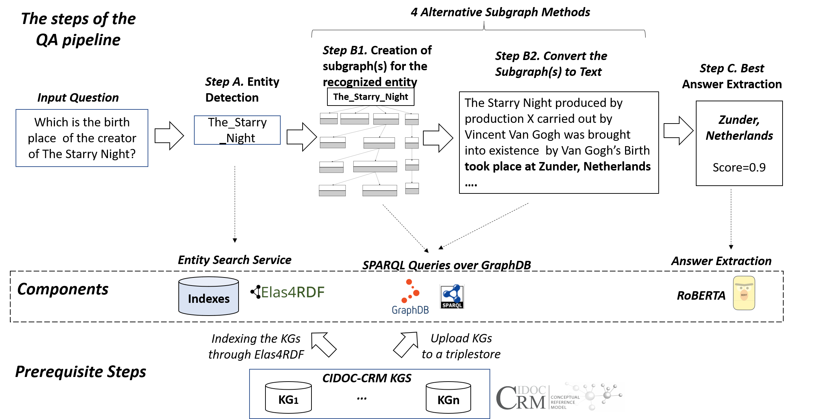

# Question Answering (QA) Component of Elas4RDF elevated to answer question on cidoc-crm KGs

### Overview

This is a FAST API service that implements the QA pipeline proposed in the following image


to Run:
```shell
uvicorn src.app:app --host=0.0.0.0 --port=5000
```

curl:
```shell
curl --location 'http://localhost:5000/answer?question=who%20created%20the%20morning%20haze%3F&depth=All&threshold=0.7&ignore_previous_depth=true&model=roberta'
```
